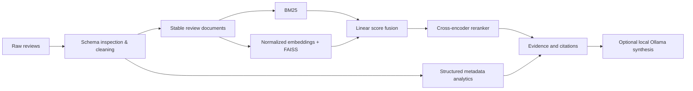

# Customer Review Retrieval & Evidence-Based Analytics

An applied information-retrieval project for answering review questions with inspectable review evidence. It deliberately separates structured product analytics from unstructured text retrieval, so a rating aggregation is never misrepresented as retrieval quality.

## Status and scope

The repository is runnable, but no Amazon dataset, manually reviewed benchmark, model index, or experimental results were present at initialization. Therefore this README contains no fabricated metrics or claims. Results are generated after running the evaluation pipeline.

## Design



Whole reviews are the primary document representation: short reviews are common, and arbitrary chunking can split the very evidence a user needs to inspect. Metadata remains filterable and is not appended to searchable prose.

## Dataset and preparation

Download Kaggle's `arhamrumi/amazon-product-reviews` manually or via an authenticated Kaggle client, place the CSV at `data/raw/Reviews.csv`, and run:

```bash
make prepare
make index
```

For a CPU-first development run, use a deterministic 5,000-review subset before
attempting the full corpus:

```bash
make prepare-dev
make index-dev
```

This validates the dense/hybrid/reranking implementation but must not be presented
as a full-corpus benchmark. The full index can be built later on a faster machine or
after confirming that the measured experiment needs it.

`prepare_data.py` validates the actual schema, retains original content, derives helpfulness/length/time fields, writes JSONL documents, and records EDA summary statistics. It rejects a dataset without `ProductId`, `Score`, and `Text` rather than guessing fields.

## Retrieval and analytics

- BM25 is a configurable lexical baseline (`k1`, `b`).
- Dense retrieval uses normalized BGE embeddings and exact FAISS inner-product search (cosine similarity after normalization).
- Hybrid is a **linear min–max normalized score fusion**, `alpha * bm25 + (1-alpha) * dense`; it is not reciprocal-rank fusion.
- A cross-encoder reranks the hybrid candidate pool, with reranking latency tracked separately.
- Product filters and averages are handled by `AnalyticsService`, then optionally constrain text search.

## Evaluation methodology

Create an auditable JSONL benchmark with `query`, `category`, `relevant_document_ids`, `expected_answer`, `evidence_basis`, and `split` (`development` or held-out `test`). The validator rejects unknown document IDs. `data/processed/benchmark_seed.jsonl` is a small model-assisted seed built from the development corpus for inspection only; its labels explicitly require human review and it must not be reported as human ground truth or used for final results. `make benchmark-silver` generates a 100-query automatic, corpus-grounded **silver** benchmark for reproducible regression experiments. Its title-derived queries can favor lexical retrieval and must never be presented as human ground truth or a complete thematic evaluation. Tune on development only, then report Recall@K, hit rate@K, precision@K, MRR, and nDCG by method and category on test.

## Run

```bash
make test
make api     # GET /health; POST /retrieve, /query, /analytics
make ui
```

The API/UI start with evidence-first BM25 retrieval and return a safe non-generative response if local generation has not been configured. Add Ollama only after the review evidence path is validated.

## Measured development experiment

On September 11, 2026, the four methods were evaluated on the held-out 25-question portion of the deterministic 5,000-review silver benchmark. The benchmark is a known-review, title-derived diagnostic: it is reproducible but favors lexical matching and is **not human relevance ground truth**.

| Method | Hit rate@1 | Hit rate@10 | MRR | nDCG@10 |
|---|---:|---:|---:|---:|
| BM25 | 0.600 | 0.760 | 0.659 | 0.684 |
| Dense (BGE-small) | 0.480 | 0.720 | 0.552 | 0.592 |
| Hybrid (α=0.50) | 0.600 | 0.800 | 0.672 | 0.703 |
| Hybrid + MiniLM reranker | **0.760** | **0.880** | **0.810** | **0.828** |

α=0.50 was selected on the separate 75-question development partition (MRR 0.693). On the CPU laptop test run, hybrid retrieval averaged 42.4 ms (P95 69.1 ms), whereas reranking added 6,627.6 ms mean latency (P95 10,440.3 ms). Thus reranking improves this diagnostic’s ordering but is not the default interactive mode.

## Limitations and next experiments

Dense, hybrid, and reranker evaluation harnesses should be run only after downloading compact local models and freezing reviewed relevance labels. Planned experiments test—not assume—hybrid/reranker gains, alpha sweep, corpus scaling, latency (mean/P95), and review chunking only for unusually long reviews. See the technical report for decisions and risks.

## Resume description

Built an evidence-grounded customer review retrieval and analytics system with BM25, dense, hybrid, reranking-ready components, structured metadata filtering, auditable evaluation interfaces, and citation-first local-generation integration. Quantitative claims are intentionally deferred until measured.
